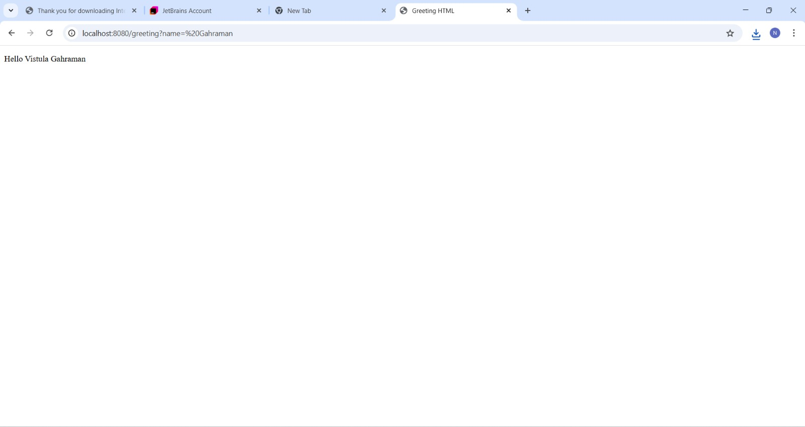

TASK 1 – Spring Boot MVC Application

Project Description
This part of the project focuses on creating a basic Spring Boot application
with a simple controller and a minimal frontend using Thymeleaf.
The goal of Task 1 is to understand how Spring Boot works, how controllers
handle HTTP requests, and how views are returned using the MVC pattern.

--------------------------------------------------

Task Requirements
- Create a new Spring Boot project from scratch
- Write the first Spring Controller
- Run the application successfully
- Send HTTP requests from a web browser
- Use the @ResponseBody annotation with understanding
- Return a simple HTML view using Thymeleaf
- Add static resources (image)

--------------------------------------------------

Project Creation
The project was created using Spring Initializr available at:
https://start.spring.io/

Selected configuration:
- Project: Maven
- Language: Java
- Spring Boot: Latest stable version (not Snapshot)
- Packaging: Jar
- Java Version: Compatible with installed JDK

Dependencies:
- Spring Web
- Lombok
- Thymeleaf

After generating the project, it was extracted and imported into the IDE.

--------------------------------------------------

Maven Configuration
After importing the project into the IDE, Maven dependencies were reloaded
using the Maven reload option.
This ensured that all Spring-related dependencies were properly downloaded.

--------------------------------------------------

First Controller
A new package was created for controllers.
Inside this package, the first controller class was implemented.

The controller handles HTTP GET requests sent to:
http://localhost:8080

The @ResponseBody annotation was used to return a plain text response
directly to the browser instead of a view.

--------------------------------------------------

Running the Application
After building and running the project, the application started successfully
on port 8080.

Accessing the following address in a browser:
http://localhost:8080

Result:
A text response returned from the controller, confirming that the application
and controller work correctly.

--------------------------------------------------

MVC Pattern Introduction
In the next step, the application was extended to follow the MVC
(Model–View–Controller) design pattern.

Instead of returning plain text, the controller now returns a view name.
Spring resolves this view using Thymeleaf.

--------------------------------------------------

Frontend View
An HTML file named:
greeting.html

was created and placed in the templates directory.

The view displays:
- A greeting message
- A static image

--------------------------------------------------

Static Resources
An image file (for example: vistula.png) was added to the static resources
directory.

The image is displayed in the greeting.html file, confirming correct handling
of static content in Spring Boot.

--------------------------------------------------

Final Result
After running the application, the frontend view is accessible via browser.
The application correctly returns an HTML page rendered by Thymeleaf,
demonstrating basic Spring MVC functionality.

--------------------------------------------------

Summary
Task 1 demonstrates:
- Creating a Spring Boot project
- Basic controller usage
- Handling HTTP GET requests
- Using @ResponseBody
- Returning views with Thymeleaf
- Applying the MVC design pattern
- Working with static resources

--------------------------------------------------

Author
GAHRAMAN Huseynov
Computer Engineering Student
Vistula University

